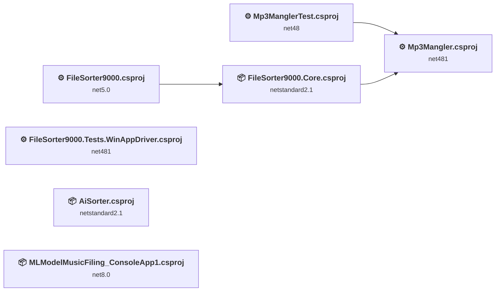
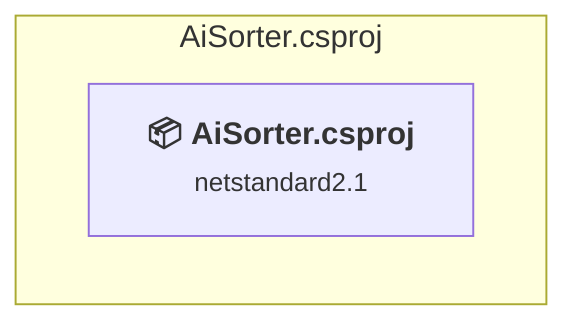
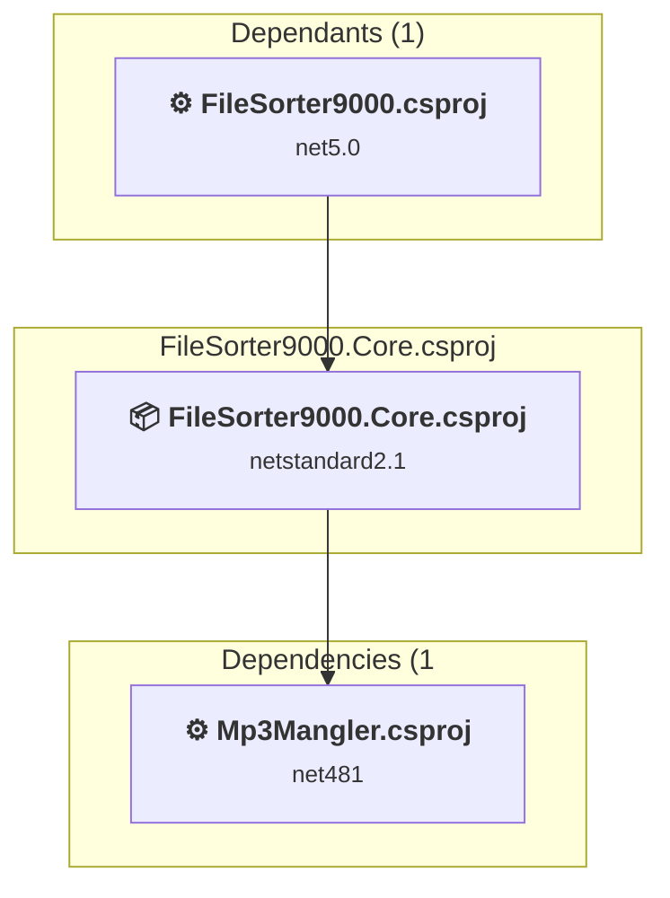
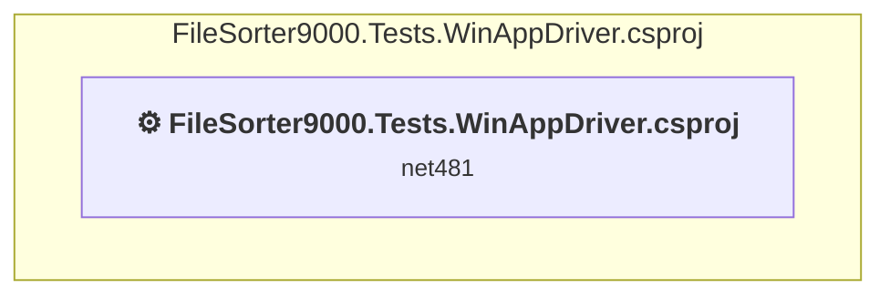
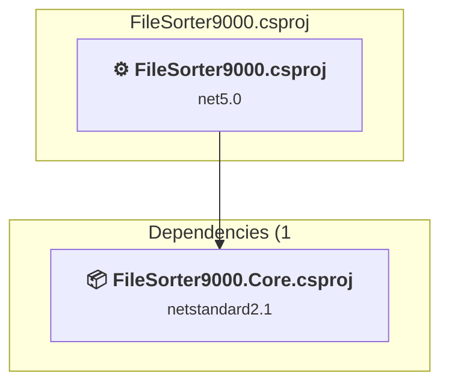
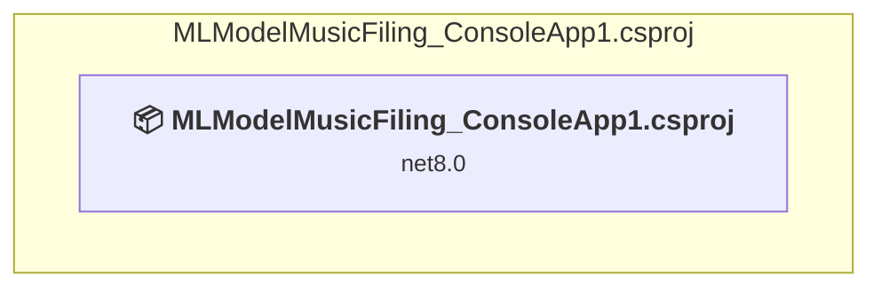
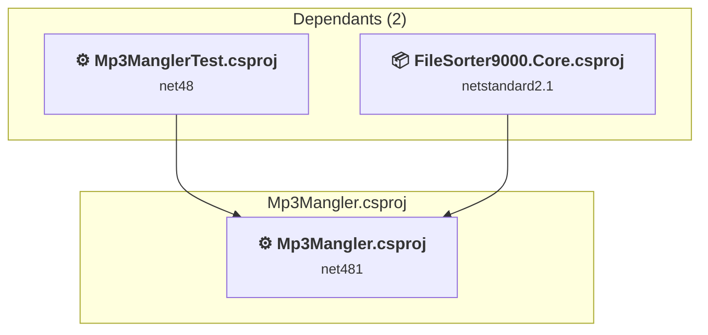
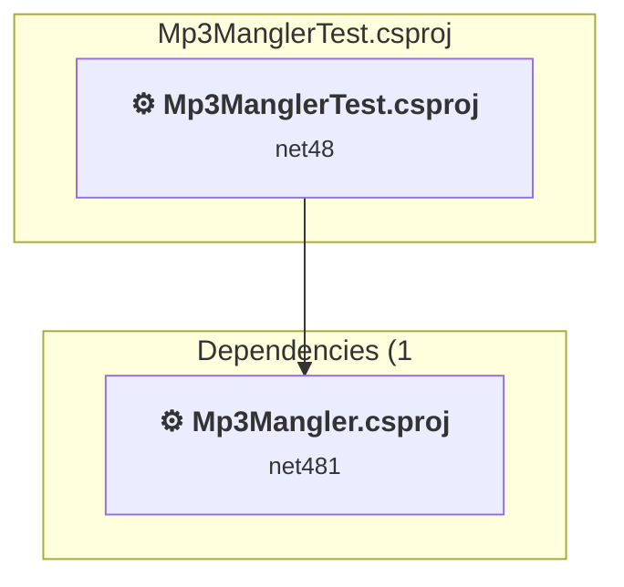

# Projects and dependencies analysis

This document provides a comprehensive overview of the projects and their dependencies in the context of upgrading to .NETCoreApp,Version=v10.0.

## Table of Contents

- [Executive Summary](#executive-Summary)
  - [Highlevel Metrics](#highlevel-metrics)
  - [Projects Compatibility](#projects-compatibility)
  - [Package Compatibility](#package-compatibility)
  - [API Compatibility](#api-compatibility)
  - [Binding Redirect Configuration](#binding-redirect-configuration)
- [Aggregate NuGet packages details](#aggregate-nuget-packages-details)
- [Top API Migration Challenges](#top-api-migration-challenges)
  - [Technologies and Features](#technologies-and-features)
  - [Most Frequent API Issues](#most-frequent-api-issues)
- [Projects Relationship Graph](#projects-relationship-graph)
- [Project Details](#project-details)

  - [AiSorter\AiSorter.csproj](#aisorteraisortercsproj)
  - [FileSorter9000.Core\FileSorter9000.Core.csproj](#filesorter9000corefilesorter9000corecsproj)
  - [FileSorter9000.Tests.WinAppDriver\FileSorter9000.Tests.WinAppDriver.csproj](#filesorter9000testswinappdriverfilesorter9000testswinappdrivercsproj)
  - [FileSorter9000\FileSorter9000.csproj](#filesorter9000filesorter9000csproj)
  - [MLModelMusicFiling_ConsoleApp1\MLModelMusicFiling_ConsoleApp1.csproj](#mlmodelmusicfiling_consoleapp1mlmodelmusicfiling_consoleapp1csproj)
  - [Mp3Mangler\Mp3Mangler.csproj](#mp3manglermp3manglercsproj)
  - [Mp3ManglerTest\Mp3ManglerTest.csproj](#mp3manglertestmp3manglertestcsproj)

## Executive Summary

### Highlevel Metrics

| Metric | Count | Status |
| :--- | :---: | :--- |
| Total Projects | 7 | All require upgrade |
| Total NuGet Packages | 176 | 19 need upgrade |
| Total Code Files | 80 |  |
| Total Code Files with Incidents | 22 |  |
| Total Lines of Code | 5335 |  |
| Total Number of Issues | 77 |  |
| Estimated LOC to modify | 30+ | at least 0.6% of codebase |

### Projects Compatibility

| Project | Target Framework | Difficulty | Package Issues | API Issues | Binding Issues | Est. LOC Impact | Description |
| :--- | :---: | :---: | :---: | :---: | :---: | :---: | :--- |
| [AiSorter\AiSorter.csproj](#aisorteraisortercsproj) | netstandard2.1 | 🟢 Low | 1 | 0 | 0 |  | ClassLibrary, Sdk Style = True |
| [FileSorter9000.Core\FileSorter9000.Core.csproj](#filesorter9000corefilesorter9000corecsproj) | netstandard2.1 | 🟢 Low | 3 | 3 | 0 | 3+ | ClassLibrary, Sdk Style = True |
| [FileSorter9000.Tests.WinAppDriver\FileSorter9000.Tests.WinAppDriver.csproj](#filesorter9000testswinappdriverfilesorter9000testswinappdrivercsproj) | net481 | 🟢 Low | 2 | 3 | 1 | 3+ | ClassicClassLibrary, Sdk Style = False |
| [FileSorter9000\FileSorter9000.csproj](#filesorter9000filesorter9000csproj) | net5.0 | 🟢 Low | 6 | 24 | 1 | 24+ | Uwp, Sdk Style = False |
| [MLModelMusicFiling_ConsoleApp1\MLModelMusicFiling_ConsoleApp1.csproj](#mlmodelmusicfiling_consoleapp1mlmodelmusicfiling_consoleapp1csproj) | net8.0 | 🟢 Low | 0 | 0 | 0 |  | DotNetCoreApp, Sdk Style = True |
| [Mp3Mangler\Mp3Mangler.csproj](#mp3manglermp3manglercsproj) | net481 | 🟢 Low | 14 | 0 | 7 |  | ClassicDotNetApp, Sdk Style = False |
| [Mp3ManglerTest\Mp3ManglerTest.csproj](#mp3manglertestmp3manglertestcsproj) | net48 | 🟢 Low | 2 | 0 | 1 |  | ClassicClassLibrary, Sdk Style = False |

### Package Compatibility

| Status | Count | Percentage |
| :--- | :---: | :---: |
| ✅ Compatible | 157 | 89.2% |
| ⚠️ Incompatible | 10 | 5.7% |
| 🔄 Upgrade Recommended | 9 | 5.1% |
| ***Total NuGet Packages*** | ***176*** | ***100%*** |

### API Compatibility

| Category | Count | Impact |
| :--- | :---: | :--- |
| 🔴 Binary Incompatible | 0 | High - Require code changes |
| 🟡 Source Incompatible | 5 | Medium - Needs re-compilation and potential conflicting API error fixing |
| 🔵 Behavioral change | 25 | Low - Behavioral changes that may require testing at runtime |
| ✅ Compatible | 4919 |  |
| ***Total APIs Analyzed*** | ***4949*** |  |

### Binding Redirect Configuration

| Severity | Count | Description |
| :--- | :---: | :--- |
| 🔴Mandatory | 3 | Must be fixed to avoid runtime failures |
| 🟡Potential | 7 | May cause issues in certain scenarios |
| ***Total Binding Issues*** | ***10*** | ***Across 4 project(s)*** |

## Aggregate NuGet packages details

| Package | Current Version | Suggested Version | Projects | Description |
| :--- | :---: | :---: | :--- | :--- |
| Appium.WebDriver | 4.3.1 |  | [FileSorter9000.Tests.WinAppDriver.csproj](#filesorter9000testswinappdriverfilesorter9000testswinappdrivercsproj) | ✅Compatible |
| Castle.Core | 4.3.1 |  | [FileSorter9000.Tests.WinAppDriver.csproj](#filesorter9000testswinappdriverfilesorter9000testswinappdrivercsproj) | ✅Compatible |
| ColorCode.Core | 2.0.6 |  | [FileSorter9000.csproj](#filesorter9000filesorter9000csproj) | ✅Compatible |
| ColorCode.UWP | 2.0.6 |  | [FileSorter9000.csproj](#filesorter9000filesorter9000csproj) | ✅Compatible |
| CsvHelper | 27.2.1 |  | [Mp3Mangler.csproj](#mp3manglermp3manglercsproj) | ✅Compatible |
| DotNetSeleniumExtras.PageObjects | 3.11.0 |  | [FileSorter9000.Tests.WinAppDriver.csproj](#filesorter9000testswinappdriverfilesorter9000testswinappdrivercsproj) | ✅Compatible |
| JetBrains.Annotations | 2021.3.0 |  | [Mp3Mangler.csproj](#mp3manglermp3manglercsproj) | ✅Compatible |
| Microsoft.AppCenter | 4.3.0 |  | [FileSorter9000.csproj](#filesorter9000filesorter9000csproj) | ✅Compatible |
| Microsoft.AppCenter.Analytics | 4.3.0 |  | [FileSorter9000.csproj](#filesorter9000filesorter9000csproj) | ✅Compatible |
| Microsoft.AppCenter.Crashes | 4.3.0 |  | [FileSorter9000.csproj](#filesorter9000filesorter9000csproj) | ✅Compatible |
| Microsoft.Bcl.AsyncInterfaces | 1.0.0 | 10.0.12 | [Mp3Mangler.csproj](#mp3manglermp3manglercsproj) | NuGet package upgrade is recommended |
| Microsoft.Bcl.AsyncInterfaces | 1.1.1 |  | [AiSorter.csproj](#aisorteraisortercsproj) | ✅Compatible |
| Microsoft.Bcl.AsyncInterfaces | 5.0.0 |  | [FileSorter9000.csproj](#filesorter9000filesorter9000csproj) | ✅Compatible |
| Microsoft.Bcl.HashCode | 1.0.0 | 6.0.0 | [Mp3Mangler.csproj](#mp3manglermp3manglercsproj) | NuGet package upgrade is recommended |
| Microsoft.CSharp | 4.3.0 | 4.7.0 | [MLModelMusicFiling_ConsoleApp1.csproj](#mlmodelmusicfiling_consoleapp1mlmodelmusicfiling_consoleapp1csproj) [Mp3Mangler.csproj](#mp3manglermp3manglercsproj) | NuGet package upgrade is recommended |
| Microsoft.Identity.Client | 4.61.3 |  | [FileSorter9000.Core.csproj](#filesorter9000corefilesorter9000corecsproj) | ⚠️NuGet package is deprecated |
| Microsoft.IdentityModel.Abstractions | 6.35.0 |  | [FileSorter9000.Core.csproj](#filesorter9000corefilesorter9000corecsproj) | ✅Compatible |
| Microsoft.ML | 1.6.0 |  | [AiSorter.csproj](#aisorteraisortercsproj) [MLModelMusicFiling_ConsoleApp1.csproj](#mlmodelmusicfiling_consoleapp1mlmodelmusicfiling_consoleapp1csproj) | ✅Compatible |
| Microsoft.ML.CpuMath | 1.6.0 |  | [AiSorter.csproj](#aisorteraisortercsproj) [MLModelMusicFiling_ConsoleApp1.csproj](#mlmodelmusicfiling_consoleapp1mlmodelmusicfiling_consoleapp1csproj) | ✅Compatible |
| Microsoft.ML.DataView | 1.6.0 |  | [AiSorter.csproj](#aisorteraisortercsproj) [MLModelMusicFiling_ConsoleApp1.csproj](#mlmodelmusicfiling_consoleapp1mlmodelmusicfiling_consoleapp1csproj) | ✅Compatible |
| Microsoft.Net.Native.Compiler | 2.2.10-rel-29722-00 |  | [FileSorter9000.csproj](#filesorter9000filesorter9000csproj) | ✅Compatible |
| Microsoft.Net.UWPCoreRuntimeSdk | 2.2.12 |  | [FileSorter9000.csproj](#filesorter9000filesorter9000csproj) | ✅Compatible |
| Microsoft.NETCore.Platforms | 1.1.0 |  | [AiSorter.csproj](#aisorteraisortercsproj) [MLModelMusicFiling_ConsoleApp1.csproj](#mlmodelmusicfiling_consoleapp1mlmodelmusicfiling_consoleapp1csproj) | ✅Compatible |
| Microsoft.NETCore.Platforms | 2.1.0 |  | [FileSorter9000.csproj](#filesorter9000filesorter9000csproj) | ✅Compatible |
| Microsoft.NETCore.Targets | 1.1.0 |  | [AiSorter.csproj](#aisorteraisortercsproj) [MLModelMusicFiling_ConsoleApp1.csproj](#mlmodelmusicfiling_consoleapp1mlmodelmusicfiling_consoleapp1csproj) | ✅Compatible |
| Microsoft.NETCore.UniversalWindowsPlatform | 6.2.12 |  | [FileSorter9000.csproj](#filesorter9000filesorter9000csproj) | Needs to be replaced with Replace with new package Microsoft.WindowsAppSDK=2.5.1;Microsoft.Graphics.Win2D=1.1.0;Microsoft.Windows.Compatibility=10.0.12 |
| Microsoft.Toolkit | 7.0.2 |  | [FileSorter9000.csproj](#filesorter9000filesorter9000csproj) | ✅Compatible |
| Microsoft.Toolkit.Mvvm | 7.1.2 |  | [FileSorter9000.csproj](#filesorter9000filesorter9000csproj) | ✅Compatible |
| Microsoft.Toolkit.Uwp | 7.0.2 |  | [FileSorter9000.csproj](#filesorter9000filesorter9000csproj) | ⚠️NuGet package is incompatible |
| Microsoft.Toolkit.Uwp.Notifications | 7.0.2 |  | [FileSorter9000.csproj](#filesorter9000filesorter9000csproj) | ✅Compatible |
| Microsoft.Toolkit.Uwp.UI | 7.0.2 |  | [FileSorter9000.csproj](#filesorter9000filesorter9000csproj) | ✅Compatible |
| Microsoft.Toolkit.Uwp.UI.Animations | 7.0.2 |  | [FileSorter9000.csproj](#filesorter9000filesorter9000csproj) | ⚠️NuGet package is incompatible |
| Microsoft.Toolkit.Uwp.UI.Controls | 7.0.2 |  | [FileSorter9000.csproj](#filesorter9000filesorter9000csproj) | ⚠️NuGet package is incompatible |
| Microsoft.Toolkit.Uwp.UI.Controls.Core | 7.0.2 |  | [FileSorter9000.csproj](#filesorter9000filesorter9000csproj) | ✅Compatible |
| Microsoft.Toolkit.Uwp.UI.Controls.DataGrid | 7.0.2 |  | [FileSorter9000.csproj](#filesorter9000filesorter9000csproj) | ✅Compatible |
| Microsoft.Toolkit.Uwp.UI.Controls.Input | 7.0.2 |  | [FileSorter9000.csproj](#filesorter9000filesorter9000csproj) | ✅Compatible |
| Microsoft.Toolkit.Uwp.UI.Controls.Layout | 7.0.2 |  | [FileSorter9000.csproj](#filesorter9000filesorter9000csproj) | ✅Compatible |
| Microsoft.Toolkit.Uwp.UI.Controls.Markdown | 7.0.2 |  | [FileSorter9000.csproj](#filesorter9000filesorter9000csproj) | ✅Compatible |
| Microsoft.Toolkit.Uwp.UI.Controls.Media | 7.0.2 |  | [FileSorter9000.csproj](#filesorter9000filesorter9000csproj) | ✅Compatible |
| Microsoft.Toolkit.Uwp.UI.Controls.Primitives | 7.0.2 |  | [FileSorter9000.csproj](#filesorter9000filesorter9000csproj) | ✅Compatible |
| Microsoft.UI.Xaml | 2.5.0 |  | [FileSorter9000.csproj](#filesorter9000filesorter9000csproj) | NuGet package functionality is included with framework reference |
| Microsoft.Win32.Primitives | 4.3.0 |  | [MLModelMusicFiling_ConsoleApp1.csproj](#mlmodelmusicfiling_consoleapp1mlmodelmusicfiling_consoleapp1csproj) | ✅Compatible |
| Microsoft.Xaml.Behaviors.Uwp.Managed | 2.0.1 |  | [FileSorter9000.csproj](#filesorter9000filesorter9000csproj) | ⚠️NuGet package is incompatible |
| MSTest.TestAdapter | 1.2.1 |  | [Mp3ManglerTest.csproj](#mp3manglertestmp3manglertestcsproj) | ⚠️NuGet package is deprecated |
| MSTest.TestAdapter | 2.2.4 |  | [FileSorter9000.Tests.WinAppDriver.csproj](#filesorter9000testswinappdriverfilesorter9000testswinappdrivercsproj) | ⚠️NuGet package is deprecated |
| MSTest.TestFramework | 1.2.1 |  | [Mp3ManglerTest.csproj](#mp3manglertestmp3manglertestcsproj) | ⚠️NuGet package is deprecated |
| MSTest.TestFramework | 2.2.4 |  | [FileSorter9000.Tests.WinAppDriver.csproj](#filesorter9000testswinappdriverfilesorter9000testswinappdrivercsproj) | ⚠️NuGet package is deprecated |
| NETStandard.Library | 1.6.1 |  | [MLModelMusicFiling_ConsoleApp1.csproj](#mlmodelmusicfiling_consoleapp1mlmodelmusicfiling_consoleapp1csproj) | ✅Compatible |
| NETStandard.Library | 2.0.3 |  | [FileSorter9000.csproj](#filesorter9000filesorter9000csproj) | ✅Compatible |
| Newtonsoft.Json | 10.0.3 |  | [MLModelMusicFiling_ConsoleApp1.csproj](#mlmodelmusicfiling_consoleapp1mlmodelmusicfiling_consoleapp1csproj) | ✅Compatible |
| Newtonsoft.Json | 12.0.1 |  | [FileSorter9000.Tests.WinAppDriver.csproj](#filesorter9000testswinappdriverfilesorter9000testswinappdrivercsproj) | ✅Compatible |
| Newtonsoft.Json | 12.0.2 |  | [FileSorter9000.csproj](#filesorter9000filesorter9000csproj) | ✅Compatible |
| Newtonsoft.Json | 12.0.3 |  | [AiSorter.csproj](#aisorteraisortercsproj) | ✅Compatible |
| Newtonsoft.Json | 13.0.1 | 13.0.4 | [FileSorter9000.Core.csproj](#filesorter9000corefilesorter9000corecsproj) [Mp3Mangler.csproj](#mp3manglermp3manglercsproj) | NuGet package upgrade is recommended |
| OpenAI | 1.2.0 |  | [AiSorter.csproj](#aisorteraisortercsproj) | ⚠️NuGet package is deprecated |
| runtime.debian.8-x64.runtime.native.System.Security.Cryptography.OpenSsl | 4.3.0 |  | [MLModelMusicFiling_ConsoleApp1.csproj](#mlmodelmusicfiling_consoleapp1mlmodelmusicfiling_consoleapp1csproj) | ✅Compatible |
| runtime.fedora.23-x64.runtime.native.System.Security.Cryptography.OpenSsl | 4.3.0 |  | [MLModelMusicFiling_ConsoleApp1.csproj](#mlmodelmusicfiling_consoleapp1mlmodelmusicfiling_consoleapp1csproj) | ✅Compatible |
| runtime.fedora.24-x64.runtime.native.System.Security.Cryptography.OpenSsl | 4.3.0 |  | [MLModelMusicFiling_ConsoleApp1.csproj](#mlmodelmusicfiling_consoleapp1mlmodelmusicfiling_consoleapp1csproj) | ✅Compatible |
| runtime.native.System | 4.3.0 |  | [MLModelMusicFiling_ConsoleApp1.csproj](#mlmodelmusicfiling_consoleapp1mlmodelmusicfiling_consoleapp1csproj) | ✅Compatible |
| runtime.native.System.IO.Compression | 4.3.0 |  | [MLModelMusicFiling_ConsoleApp1.csproj](#mlmodelmusicfiling_consoleapp1mlmodelmusicfiling_consoleapp1csproj) | ✅Compatible |
| runtime.native.System.Net.Http | 4.3.0 |  | [MLModelMusicFiling_ConsoleApp1.csproj](#mlmodelmusicfiling_consoleapp1mlmodelmusicfiling_consoleapp1csproj) | ✅Compatible |
| runtime.native.System.Security.Cryptography.Apple | 4.3.0 |  | [MLModelMusicFiling_ConsoleApp1.csproj](#mlmodelmusicfiling_consoleapp1mlmodelmusicfiling_consoleapp1csproj) | ✅Compatible |
| runtime.native.System.Security.Cryptography.OpenSsl | 4.3.0 |  | [MLModelMusicFiling_ConsoleApp1.csproj](#mlmodelmusicfiling_consoleapp1mlmodelmusicfiling_consoleapp1csproj) | ✅Compatible |
| runtime.opensuse.13.2-x64.runtime.native.System.Security.Cryptography.OpenSsl | 4.3.0 |  | [MLModelMusicFiling_ConsoleApp1.csproj](#mlmodelmusicfiling_consoleapp1mlmodelmusicfiling_consoleapp1csproj) | ✅Compatible |
| runtime.opensuse.42.1-x64.runtime.native.System.Security.Cryptography.OpenSsl | 4.3.0 |  | [MLModelMusicFiling_ConsoleApp1.csproj](#mlmodelmusicfiling_consoleapp1mlmodelmusicfiling_consoleapp1csproj) | ✅Compatible |
| runtime.osx.10.10-x64.runtime.native.System.Security.Cryptography.Apple | 4.3.0 |  | [MLModelMusicFiling_ConsoleApp1.csproj](#mlmodelmusicfiling_consoleapp1mlmodelmusicfiling_consoleapp1csproj) | ✅Compatible |
| runtime.osx.10.10-x64.runtime.native.System.Security.Cryptography.OpenSsl | 4.3.0 |  | [MLModelMusicFiling_ConsoleApp1.csproj](#mlmodelmusicfiling_consoleapp1mlmodelmusicfiling_consoleapp1csproj) | ✅Compatible |
| runtime.rhel.7-x64.runtime.native.System.Security.Cryptography.OpenSsl | 4.3.0 |  | [MLModelMusicFiling_ConsoleApp1.csproj](#mlmodelmusicfiling_consoleapp1mlmodelmusicfiling_consoleapp1csproj) | ✅Compatible |
| runtime.ubuntu.14.04-x64.runtime.native.System.Security.Cryptography.OpenSsl | 4.3.0 |  | [MLModelMusicFiling_ConsoleApp1.csproj](#mlmodelmusicfiling_consoleapp1mlmodelmusicfiling_consoleapp1csproj) | ✅Compatible |
| runtime.ubuntu.16.04-x64.runtime.native.System.Security.Cryptography.OpenSsl | 4.3.0 |  | [MLModelMusicFiling_ConsoleApp1.csproj](#mlmodelmusicfiling_consoleapp1mlmodelmusicfiling_consoleapp1csproj) | ✅Compatible |
| runtime.ubuntu.16.10-x64.runtime.native.System.Security.Cryptography.OpenSsl | 4.3.0 |  | [MLModelMusicFiling_ConsoleApp1.csproj](#mlmodelmusicfiling_consoleapp1mlmodelmusicfiling_consoleapp1csproj) | ✅Compatible |
| runtime.win10-arm.Microsoft.Net.Native.Compiler | 2.2.10-rel-29722-00 |  | [FileSorter9000.csproj](#filesorter9000filesorter9000csproj) | ✅Compatible |
| runtime.win10-arm.Microsoft.Net.Native.SharedLibrary | 2.2.8-rel-29722-00 |  | [FileSorter9000.csproj](#filesorter9000filesorter9000csproj) | ✅Compatible |
| runtime.win10-arm.Microsoft.Net.UWPCoreRuntimeSdk | 2.2.12 |  | [FileSorter9000.csproj](#filesorter9000filesorter9000csproj) | ✅Compatible |
| runtime.win10-arm64.Microsoft.Net.Native.Compiler | 2.2.10-rel-29722-00 |  | [FileSorter9000.csproj](#filesorter9000filesorter9000csproj) | ✅Compatible |
| runtime.win10-arm64.Microsoft.Net.Native.SharedLibrary | 2.2.8-rel-29722-00 |  | [FileSorter9000.csproj](#filesorter9000filesorter9000csproj) | ✅Compatible |
| runtime.win10-x64.Microsoft.Net.Native.Compiler | 2.2.10-rel-29722-00 |  | [FileSorter9000.csproj](#filesorter9000filesorter9000csproj) | ✅Compatible |
| runtime.win10-x64.Microsoft.Net.Native.SharedLibrary | 2.2.8-rel-29722-00 |  | [FileSorter9000.csproj](#filesorter9000filesorter9000csproj) | ✅Compatible |
| runtime.win10-x64.Microsoft.Net.UWPCoreRuntimeSdk | 2.2.12 |  | [FileSorter9000.csproj](#filesorter9000filesorter9000csproj) | ✅Compatible |
| runtime.win10-x86.Microsoft.Net.Native.Compiler | 2.2.10-rel-29722-00 |  | [FileSorter9000.csproj](#filesorter9000filesorter9000csproj) | ✅Compatible |
| runtime.win10-x86.Microsoft.Net.Native.SharedLibrary | 2.2.8-rel-29722-00 |  | [FileSorter9000.csproj](#filesorter9000filesorter9000csproj) | ✅Compatible |
| runtime.win10-x86.Microsoft.Net.UWPCoreRuntimeSdk | 2.2.12 |  | [FileSorter9000.csproj](#filesorter9000filesorter9000csproj) | ✅Compatible |
| Selenium.Support | 3.141.0 |  | [FileSorter9000.Tests.WinAppDriver.csproj](#filesorter9000testswinappdriverfilesorter9000testswinappdrivercsproj) | ✅Compatible |
| Selenium.WebDriver | 3.141.0 |  | [FileSorter9000.Tests.WinAppDriver.csproj](#filesorter9000testswinappdriverfilesorter9000testswinappdrivercsproj) | ✅Compatible |
| SQLitePCLRaw.bundle_green | 2.0.2 |  | [FileSorter9000.csproj](#filesorter9000filesorter9000csproj) | ✅Compatible |
| SQLitePCLRaw.core | 2.0.2 |  | [FileSorter9000.csproj](#filesorter9000filesorter9000csproj) | ✅Compatible |
| SQLitePCLRaw.lib.e_sqlite3 | 2.0.2 |  | [FileSorter9000.csproj](#filesorter9000filesorter9000csproj) | ✅Compatible |
| SQLitePCLRaw.provider.e_sqlite3 | 2.0.2 |  | [FileSorter9000.csproj](#filesorter9000filesorter9000csproj) | ✅Compatible |
| System.AppContext | 4.3.0 |  | [MLModelMusicFiling_ConsoleApp1.csproj](#mlmodelmusicfiling_consoleapp1mlmodelmusicfiling_consoleapp1csproj) | ✅Compatible |
| System.Buffers | 4.3.0 |  | [MLModelMusicFiling_ConsoleApp1.csproj](#mlmodelmusicfiling_consoleapp1mlmodelmusicfiling_consoleapp1csproj) | ✅Compatible |
| System.Buffers | 4.4.0 |  | [AiSorter.csproj](#aisorteraisortercsproj) [Mp3Mangler.csproj](#mp3manglermp3manglercsproj) | NuGet package functionality is included with framework reference |
| System.Buffers | 4.5.1 |  | [FileSorter9000.Core.csproj](#filesorter9000corefilesorter9000corecsproj) | ✅Compatible |
| System.CodeDom | 4.4.0 | 10.0.12 | [AiSorter.csproj](#aisorteraisortercsproj) [MLModelMusicFiling_ConsoleApp1.csproj](#mlmodelmusicfiling_consoleapp1mlmodelmusicfiling_consoleapp1csproj) [Mp3Mangler.csproj](#mp3manglermp3manglercsproj) | NuGet package upgrade is recommended |
| System.Collections | 4.3.0 |  | [MLModelMusicFiling_ConsoleApp1.csproj](#mlmodelmusicfiling_consoleapp1mlmodelmusicfiling_consoleapp1csproj) | ✅Compatible |
| System.Collections.Concurrent | 4.3.0 |  | [MLModelMusicFiling_ConsoleApp1.csproj](#mlmodelmusicfiling_consoleapp1mlmodelmusicfiling_consoleapp1csproj) | ✅Compatible |
| System.Collections.Immutable | 1.5.0 | 10.0.12 | [AiSorter.csproj](#aisorteraisortercsproj) [MLModelMusicFiling_ConsoleApp1.csproj](#mlmodelmusicfiling_consoleapp1mlmodelmusicfiling_consoleapp1csproj) [Mp3Mangler.csproj](#mp3manglermp3manglercsproj) | NuGet package upgrade is recommended |
| System.Collections.Immutable | 1.6.0 |  | [FileSorter9000.csproj](#filesorter9000filesorter9000csproj) | ✅Compatible |
| System.Collections.NonGeneric | 4.3.0 |  | [MLModelMusicFiling_ConsoleApp1.csproj](#mlmodelmusicfiling_consoleapp1mlmodelmusicfiling_consoleapp1csproj) | ✅Compatible |
| System.Collections.Specialized | 4.3.0 |  | [MLModelMusicFiling_ConsoleApp1.csproj](#mlmodelmusicfiling_consoleapp1mlmodelmusicfiling_consoleapp1csproj) | ✅Compatible |
| System.ComponentModel | 4.3.0 |  | [MLModelMusicFiling_ConsoleApp1.csproj](#mlmodelmusicfiling_consoleapp1mlmodelmusicfiling_consoleapp1csproj) | ✅Compatible |
| System.ComponentModel.Annotations | 5.0.0 |  | [FileSorter9000.csproj](#filesorter9000filesorter9000csproj) | ✅Compatible |
| System.ComponentModel.Primitives | 4.3.0 |  | [MLModelMusicFiling_ConsoleApp1.csproj](#mlmodelmusicfiling_consoleapp1mlmodelmusicfiling_consoleapp1csproj) | ✅Compatible |
| System.ComponentModel.TypeConverter | 4.3.0 |  | [MLModelMusicFiling_ConsoleApp1.csproj](#mlmodelmusicfiling_consoleapp1mlmodelmusicfiling_consoleapp1csproj) | ✅Compatible |
| System.Configuration.ConfigurationManager | 4.7.0 | 10.0.12 | [FileSorter9000.Core.csproj](#filesorter9000corefilesorter9000corecsproj) | NuGet package upgrade is recommended |
| System.Console | 4.3.0 |  | [MLModelMusicFiling_ConsoleApp1.csproj](#mlmodelmusicfiling_consoleapp1mlmodelmusicfiling_consoleapp1csproj) | ✅Compatible |
| System.Diagnostics.Debug | 4.3.0 |  | [MLModelMusicFiling_ConsoleApp1.csproj](#mlmodelmusicfiling_consoleapp1mlmodelmusicfiling_consoleapp1csproj) | ✅Compatible |
| System.Diagnostics.DiagnosticSource | 4.3.0 |  | [MLModelMusicFiling_ConsoleApp1.csproj](#mlmodelmusicfiling_consoleapp1mlmodelmusicfiling_consoleapp1csproj) | ✅Compatible |
| System.Diagnostics.DiagnosticSource | 6.0.1 |  | [FileSorter9000.Core.csproj](#filesorter9000corefilesorter9000corecsproj) | ✅Compatible |
| System.Diagnostics.Tools | 4.3.0 |  | [MLModelMusicFiling_ConsoleApp1.csproj](#mlmodelmusicfiling_consoleapp1mlmodelmusicfiling_consoleapp1csproj) | ✅Compatible |
| System.Diagnostics.Tracing | 4.3.0 |  | [MLModelMusicFiling_ConsoleApp1.csproj](#mlmodelmusicfiling_consoleapp1mlmodelmusicfiling_consoleapp1csproj) | ✅Compatible |
| System.Dynamic.Runtime | 4.3.0 |  | [MLModelMusicFiling_ConsoleApp1.csproj](#mlmodelmusicfiling_consoleapp1mlmodelmusicfiling_consoleapp1csproj) | ✅Compatible |
| System.Globalization | 4.3.0 |  | [MLModelMusicFiling_ConsoleApp1.csproj](#mlmodelmusicfiling_consoleapp1mlmodelmusicfiling_consoleapp1csproj) | ✅Compatible |
| System.Globalization.Calendars | 4.3.0 |  | [MLModelMusicFiling_ConsoleApp1.csproj](#mlmodelmusicfiling_consoleapp1mlmodelmusicfiling_consoleapp1csproj) | ✅Compatible |
| System.Globalization.Extensions | 4.3.0 |  | [MLModelMusicFiling_ConsoleApp1.csproj](#mlmodelmusicfiling_consoleapp1mlmodelmusicfiling_consoleapp1csproj) | ✅Compatible |
| System.IO | 4.3.0 |  | [AiSorter.csproj](#aisorteraisortercsproj) [MLModelMusicFiling_ConsoleApp1.csproj](#mlmodelmusicfiling_consoleapp1mlmodelmusicfiling_consoleapp1csproj) | ✅Compatible |
| System.IO.Compression | 4.3.0 |  | [MLModelMusicFiling_ConsoleApp1.csproj](#mlmodelmusicfiling_consoleapp1mlmodelmusicfiling_consoleapp1csproj) | ✅Compatible |
| System.IO.Compression.ZipFile | 4.3.0 |  | [MLModelMusicFiling_ConsoleApp1.csproj](#mlmodelmusicfiling_consoleapp1mlmodelmusicfiling_consoleapp1csproj) | ✅Compatible |
| System.IO.FileSystem | 4.3.0 |  | [MLModelMusicFiling_ConsoleApp1.csproj](#mlmodelmusicfiling_consoleapp1mlmodelmusicfiling_consoleapp1csproj) | ✅Compatible |
| System.IO.FileSystem.Primitives | 4.3.0 |  | [MLModelMusicFiling_ConsoleApp1.csproj](#mlmodelmusicfiling_consoleapp1mlmodelmusicfiling_consoleapp1csproj) | ✅Compatible |
| System.Linq | 4.3.0 |  | [MLModelMusicFiling_ConsoleApp1.csproj](#mlmodelmusicfiling_consoleapp1mlmodelmusicfiling_consoleapp1csproj) | ✅Compatible |
| System.Linq.Expressions | 4.3.0 |  | [MLModelMusicFiling_ConsoleApp1.csproj](#mlmodelmusicfiling_consoleapp1mlmodelmusicfiling_consoleapp1csproj) | ✅Compatible |
| System.Memory | 4.5.3 |  | [AiSorter.csproj](#aisorteraisortercsproj) [MLModelMusicFiling_ConsoleApp1.csproj](#mlmodelmusicfiling_consoleapp1mlmodelmusicfiling_consoleapp1csproj) [Mp3Mangler.csproj](#mp3manglermp3manglercsproj) | NuGet package functionality is included with framework reference |
| System.Memory | 4.5.4 |  | [FileSorter9000.Core.csproj](#filesorter9000corefilesorter9000corecsproj) [FileSorter9000.csproj](#filesorter9000filesorter9000csproj) | ✅Compatible |
| System.Net.Http | 4.3.0 |  | [MLModelMusicFiling_ConsoleApp1.csproj](#mlmodelmusicfiling_consoleapp1mlmodelmusicfiling_consoleapp1csproj) | ✅Compatible |
| System.Net.Primitives | 4.3.0 |  | [MLModelMusicFiling_ConsoleApp1.csproj](#mlmodelmusicfiling_consoleapp1mlmodelmusicfiling_consoleapp1csproj) | ✅Compatible |
| System.Net.Sockets | 4.3.0 |  | [MLModelMusicFiling_ConsoleApp1.csproj](#mlmodelmusicfiling_consoleapp1mlmodelmusicfiling_consoleapp1csproj) | ✅Compatible |
| System.Numerics.Vectors | 4.4.0 |  | [AiSorter.csproj](#aisorteraisortercsproj) [FileSorter9000.Core.csproj](#filesorter9000corefilesorter9000corecsproj) [Mp3Mangler.csproj](#mp3manglermp3manglercsproj) | NuGet package functionality is included with framework reference |
| System.ObjectModel | 4.3.0 |  | [MLModelMusicFiling_ConsoleApp1.csproj](#mlmodelmusicfiling_consoleapp1mlmodelmusicfiling_consoleapp1csproj) | ✅Compatible |
| System.Reflection | 4.3.0 |  | [AiSorter.csproj](#aisorteraisortercsproj) [MLModelMusicFiling_ConsoleApp1.csproj](#mlmodelmusicfiling_consoleapp1mlmodelmusicfiling_consoleapp1csproj) | ✅Compatible |
| System.Reflection.Emit | 4.3.0 |  | [MLModelMusicFiling_ConsoleApp1.csproj](#mlmodelmusicfiling_consoleapp1mlmodelmusicfiling_consoleapp1csproj) | ✅Compatible |
| System.Reflection.Emit.ILGeneration | 4.3.0 |  | [AiSorter.csproj](#aisorteraisortercsproj) [MLModelMusicFiling_ConsoleApp1.csproj](#mlmodelmusicfiling_consoleapp1mlmodelmusicfiling_consoleapp1csproj) | ✅Compatible |
| System.Reflection.Emit.Lightweight | 4.3.0 |  | [AiSorter.csproj](#aisorteraisortercsproj) [MLModelMusicFiling_ConsoleApp1.csproj](#mlmodelmusicfiling_consoleapp1mlmodelmusicfiling_consoleapp1csproj) [Mp3Mangler.csproj](#mp3manglermp3manglercsproj) | NuGet package functionality is included with framework reference |
| System.Reflection.Extensions | 4.3.0 |  | [MLModelMusicFiling_ConsoleApp1.csproj](#mlmodelmusicfiling_consoleapp1mlmodelmusicfiling_consoleapp1csproj) | ✅Compatible |
| System.Reflection.Metadata | 1.7.0 |  | [FileSorter9000.csproj](#filesorter9000filesorter9000csproj) | ✅Compatible |
| System.Reflection.Primitives | 4.3.0 |  | [AiSorter.csproj](#aisorteraisortercsproj) [MLModelMusicFiling_ConsoleApp1.csproj](#mlmodelmusicfiling_consoleapp1mlmodelmusicfiling_consoleapp1csproj) | ✅Compatible |
| System.Reflection.TypeExtensions | 4.3.0 |  | [MLModelMusicFiling_ConsoleApp1.csproj](#mlmodelmusicfiling_consoleapp1mlmodelmusicfiling_consoleapp1csproj) | ✅Compatible |
| System.Resources.ResourceManager | 4.3.0 |  | [MLModelMusicFiling_ConsoleApp1.csproj](#mlmodelmusicfiling_consoleapp1mlmodelmusicfiling_consoleapp1csproj) | ✅Compatible |
| System.Runtime | 4.3.0 |  | [AiSorter.csproj](#aisorteraisortercsproj) [MLModelMusicFiling_ConsoleApp1.csproj](#mlmodelmusicfiling_consoleapp1mlmodelmusicfiling_consoleapp1csproj) | ✅Compatible |
| System.Runtime.CompilerServices.Unsafe | 4.5.3 | 6.1.2 | [AiSorter.csproj](#aisorteraisortercsproj) [Mp3Mangler.csproj](#mp3manglermp3manglercsproj) | NuGet package upgrade is recommended |
| System.Runtime.CompilerServices.Unsafe | 5.0.0 |  | [FileSorter9000.csproj](#filesorter9000filesorter9000csproj) | ✅Compatible |
| System.Runtime.CompilerServices.Unsafe | 6.0.0 |  | [FileSorter9000.Core.csproj](#filesorter9000corefilesorter9000corecsproj) | ✅Compatible |
| System.Runtime.Extensions | 4.3.0 |  | [MLModelMusicFiling_ConsoleApp1.csproj](#mlmodelmusicfiling_consoleapp1mlmodelmusicfiling_consoleapp1csproj) | ✅Compatible |
| System.Runtime.Handles | 4.3.0 |  | [MLModelMusicFiling_ConsoleApp1.csproj](#mlmodelmusicfiling_consoleapp1mlmodelmusicfiling_consoleapp1csproj) | ✅Compatible |
| System.Runtime.InteropServices | 4.3.0 |  | [MLModelMusicFiling_ConsoleApp1.csproj](#mlmodelmusicfiling_consoleapp1mlmodelmusicfiling_consoleapp1csproj) | ✅Compatible |
| System.Runtime.InteropServices.RuntimeInformation | 4.3.0 |  | [MLModelMusicFiling_ConsoleApp1.csproj](#mlmodelmusicfiling_consoleapp1mlmodelmusicfiling_consoleapp1csproj) | ✅Compatible |
| System.Runtime.Numerics | 4.3.0 |  | [MLModelMusicFiling_ConsoleApp1.csproj](#mlmodelmusicfiling_consoleapp1mlmodelmusicfiling_consoleapp1csproj) | ✅Compatible |
| System.Runtime.Serialization.Formatters | 4.3.0 |  | [MLModelMusicFiling_ConsoleApp1.csproj](#mlmodelmusicfiling_consoleapp1mlmodelmusicfiling_consoleapp1csproj) | ✅Compatible |
| System.Runtime.Serialization.Primitives | 4.3.0 |  | [MLModelMusicFiling_ConsoleApp1.csproj](#mlmodelmusicfiling_consoleapp1mlmodelmusicfiling_consoleapp1csproj) | ✅Compatible |
| System.Security.AccessControl | 4.7.0 |  | [FileSorter9000.Core.csproj](#filesorter9000corefilesorter9000corecsproj) | ✅Compatible |
| System.Security.Cryptography.Algorithms | 4.3.0 |  | [MLModelMusicFiling_ConsoleApp1.csproj](#mlmodelmusicfiling_consoleapp1mlmodelmusicfiling_consoleapp1csproj) | ✅Compatible |
| System.Security.Cryptography.Cng | 4.3.0 |  | [MLModelMusicFiling_ConsoleApp1.csproj](#mlmodelmusicfiling_consoleapp1mlmodelmusicfiling_consoleapp1csproj) | ✅Compatible |
| System.Security.Cryptography.Csp | 4.3.0 |  | [MLModelMusicFiling_ConsoleApp1.csproj](#mlmodelmusicfiling_consoleapp1mlmodelmusicfiling_consoleapp1csproj) | ✅Compatible |
| System.Security.Cryptography.Encoding | 4.3.0 |  | [MLModelMusicFiling_ConsoleApp1.csproj](#mlmodelmusicfiling_consoleapp1mlmodelmusicfiling_consoleapp1csproj) | ✅Compatible |
| System.Security.Cryptography.OpenSsl | 4.3.0 |  | [MLModelMusicFiling_ConsoleApp1.csproj](#mlmodelmusicfiling_consoleapp1mlmodelmusicfiling_consoleapp1csproj) | ✅Compatible |
| System.Security.Cryptography.Primitives | 4.3.0 |  | [MLModelMusicFiling_ConsoleApp1.csproj](#mlmodelmusicfiling_consoleapp1mlmodelmusicfiling_consoleapp1csproj) | ✅Compatible |
| System.Security.Cryptography.ProtectedData | 4.7.0 |  | [FileSorter9000.Core.csproj](#filesorter9000corefilesorter9000corecsproj) | ✅Compatible |
| System.Security.Cryptography.X509Certificates | 4.3.0 |  | [MLModelMusicFiling_ConsoleApp1.csproj](#mlmodelmusicfiling_consoleapp1mlmodelmusicfiling_consoleapp1csproj) | ✅Compatible |
| System.Security.Permissions | 4.7.0 |  | [FileSorter9000.Core.csproj](#filesorter9000corefilesorter9000corecsproj) | ✅Compatible |
| System.Security.Principal.Windows | 4.7.0 |  | [FileSorter9000.Core.csproj](#filesorter9000corefilesorter9000corecsproj) | ✅Compatible |
| System.Text.Encoding | 4.3.0 |  | [AiSorter.csproj](#aisorteraisortercsproj) [MLModelMusicFiling_ConsoleApp1.csproj](#mlmodelmusicfiling_consoleapp1mlmodelmusicfiling_consoleapp1csproj) | ✅Compatible |
| System.Text.Encoding.Extensions | 4.3.0 |  | [MLModelMusicFiling_ConsoleApp1.csproj](#mlmodelmusicfiling_consoleapp1mlmodelmusicfiling_consoleapp1csproj) | ✅Compatible |
| System.Text.Encodings.Web | 5.0.1 |  | [FileSorter9000.csproj](#filesorter9000filesorter9000csproj) | ✅Compatible |
| System.Text.Json | 5.0.2 |  | [FileSorter9000.csproj](#filesorter9000filesorter9000csproj) | ✅Compatible |
| System.Text.RegularExpressions | 4.3.0 |  | [MLModelMusicFiling_ConsoleApp1.csproj](#mlmodelmusicfiling_consoleapp1mlmodelmusicfiling_consoleapp1csproj) | ✅Compatible |
| System.Threading | 4.3.0 |  | [MLModelMusicFiling_ConsoleApp1.csproj](#mlmodelmusicfiling_consoleapp1mlmodelmusicfiling_consoleapp1csproj) | ✅Compatible |
| System.Threading.Channels | 4.7.1 | 10.0.12 | [AiSorter.csproj](#aisorteraisortercsproj) [MLModelMusicFiling_ConsoleApp1.csproj](#mlmodelmusicfiling_consoleapp1mlmodelmusicfiling_consoleapp1csproj) [Mp3Mangler.csproj](#mp3manglermp3manglercsproj) | NuGet package upgrade is recommended |
| System.Threading.Tasks | 4.3.0 |  | [AiSorter.csproj](#aisorteraisortercsproj) [MLModelMusicFiling_ConsoleApp1.csproj](#mlmodelmusicfiling_consoleapp1mlmodelmusicfiling_consoleapp1csproj) | ✅Compatible |
| System.Threading.Tasks.Extensions | 4.3.0 |  | [MLModelMusicFiling_ConsoleApp1.csproj](#mlmodelmusicfiling_consoleapp1mlmodelmusicfiling_consoleapp1csproj) | ✅Compatible |
| System.Threading.Tasks.Extensions | 4.5.4 |  | [AiSorter.csproj](#aisorteraisortercsproj) [FileSorter9000.csproj](#filesorter9000filesorter9000csproj) [Mp3Mangler.csproj](#mp3manglermp3manglercsproj) | NuGet package functionality is included with framework reference |
| System.Threading.Timer | 4.3.0 |  | [MLModelMusicFiling_ConsoleApp1.csproj](#mlmodelmusicfiling_consoleapp1mlmodelmusicfiling_consoleapp1csproj) | ✅Compatible |
| System.ValueTuple | 4.5.0 |  | [FileSorter9000.csproj](#filesorter9000filesorter9000csproj) | ✅Compatible |
| System.Xml.ReaderWriter | 4.3.0 |  | [MLModelMusicFiling_ConsoleApp1.csproj](#mlmodelmusicfiling_consoleapp1mlmodelmusicfiling_consoleapp1csproj) | ✅Compatible |
| System.Xml.XDocument | 4.3.0 |  | [MLModelMusicFiling_ConsoleApp1.csproj](#mlmodelmusicfiling_consoleapp1mlmodelmusicfiling_consoleapp1csproj) | ✅Compatible |
| System.Xml.XmlDocument | 4.3.0 |  | [MLModelMusicFiling_ConsoleApp1.csproj](#mlmodelmusicfiling_consoleapp1mlmodelmusicfiling_consoleapp1csproj) | ✅Compatible |
| taglib | 2.1.0.0 |  | [Mp3Mangler.csproj](#mp3manglermp3manglercsproj) | ✅Compatible |
| Win2D.uwp | 1.25.0 |  | [FileSorter9000.csproj](#filesorter9000filesorter9000csproj) | ✅Compatible |

## Top API Migration Challenges

### Technologies and Features

| Technology | Issues | Percentage | Migration Path |
| :--- | :---: | :---: | :--- |

### Most Frequent API Issues

| API | Count | Percentage | Category |
| :--- | :---: | :---: | :--- |
| T:System.Uri | 11 | 36.7% | Behavioral Change |
| M:System.Uri.#ctor(System.String) | 11 | 36.7% | Behavioral Change |
| T:System.Net.Http.HttpContent | 2 | 6.7% | Behavioral Change |
| M:System.TimeSpan.FromSeconds(System.Double) | 2 | 6.7% | Source Incompatible |
| M:System.Net.Http.HttpContent.ReadAsStreamAsync | 1 | 3.3% | Behavioral Change |
| T:System.WindowsRuntimeSystemExtensions | 1 | 3.3% | Source Incompatible |
| T:System.Runtime.InteropServices.WindowsRuntime.WindowsRuntimeBufferExtensions | 1 | 3.3% | Source Incompatible |
| M:System.Runtime.InteropServices.WindowsRuntime.WindowsRuntimeBufferExtensions.AsBuffer(System.Byte[]) | 1 | 3.3% | Source Incompatible |

## Projects Relationship Graph

Legend:
📦 SDK-style project
⚙️ Classic project

## Project Details

### AiSorter\AiSorter.csproj

#### Project Info

- **Current Target Framework:** netstandard2.1✅
- **SDK-style**: True
- **Project Kind:** ClassLibrary
- **Dependencies**: 0
- **Dependants**: 0
- **Number of Files**: 4
- **Number of Files with Incidents**: 1
- **Lines of Code**: 266
- **Estimated LOC to modify**: 0+ (at least 0.0% of the project)

#### Dependency Graph

Legend:
📦 SDK-style project
⚙️ Classic project

### API Compatibility

| Category | Count | Impact |
| :--- | :---: | :--- |
| 🔴 Binary Incompatible | 0 | High - Require code changes |
| 🟡 Source Incompatible | 0 | Medium - Needs re-compilation and potential conflicting API error fixing |
| 🔵 Behavioral change | 0 | Low - Behavioral changes that may require testing at runtime |
| ✅ Compatible | 150 |  |
| ***Total APIs Analyzed*** | ***150*** |  |

### FileSorter9000.Core\FileSorter9000.Core.csproj

#### Project Info

- **Current Target Framework:** netstandard2.1✅
- **SDK-style**: True
- **Project Kind:** ClassLibrary
- **Dependencies**: 1
- **Dependants**: 1
- **Number of Files**: 14
- **Number of Files with Incidents**: 2
- **Lines of Code**: 631
- **Estimated LOC to modify**: 3+ (at least 0.5% of the project)

#### Dependency Graph

Legend:
📦 SDK-style project
⚙️ Classic project

### API Compatibility

| Category | Count | Impact |
| :--- | :---: | :--- |
| 🔴 Binary Incompatible | 0 | High - Require code changes |
| 🟡 Source Incompatible | 0 | Medium - Needs re-compilation and potential conflicting API error fixing |
| 🔵 Behavioral change | 3 | Low - Behavioral changes that may require testing at runtime |
| ✅ Compatible | 435 |  |
| ***Total APIs Analyzed*** | ***438*** |  |

### FileSorter9000.Tests.WinAppDriver\FileSorter9000.Tests.WinAppDriver.csproj

#### Project Info

- **Current Target Framework:** net481
- **Proposed Target Framework:** net10.0
- **SDK-style**: False
- **Project Kind:** ClassicClassLibrary
- **Dependencies**: 0
- **Dependants**: 0
- **Number of Files**: 2
- **Number of Files with Incidents**: 2
- **Lines of Code**: 100
- **Estimated LOC to modify**: 3+ (at least 3.0% of the project)

#### Dependency Graph

Legend:
📦 SDK-style project
⚙️ Classic project

### API Compatibility

| Category | Count | Impact |
| :--- | :---: | :--- |
| 🔴 Binary Incompatible | 0 | High - Require code changes |
| 🟡 Source Incompatible | 1 | Medium - Needs re-compilation and potential conflicting API error fixing |
| 🔵 Behavioral change | 2 | Low - Behavioral changes that may require testing at runtime |
| ✅ Compatible | 102 |  |
| ***Total APIs Analyzed*** | ***105*** |  |

#### Binding Redirect Configuration

| Rule | Severity | Details | Recommendation |
| :--- | :---: | :--- | :--- |
| Library-hosted entry point missing GenerateBindingRedirectsOutputType | 🟡Potential | OutputType=Library with test framework references, GenerateBindingRedirectsOutputType not set | Add <GenerateBindingRedirectsOutputType>true</GenerateBindingRedirectsOutputType> so MSBuild generates redirects for library-hosted entry points. |

### FileSorter9000\FileSorter9000.csproj

#### Project Info

- **Current Target Framework:** net5.0
- **Proposed Target Framework:** net10.0-windows10.0.26100.0
- **SDK-style**: False
- **Project Kind:** Uwp
- **Dependencies**: 1
- **Dependants**: 0
- **Number of Files**: 124
- **Number of Files with Incidents**: 13
- **Lines of Code**: 3177
- **Estimated LOC to modify**: 24+ (at least 0.8% of the project)

#### Dependency Graph

Legend:
📦 SDK-style project
⚙️ Classic project

### API Compatibility

| Category | Count | Impact |
| :--- | :---: | :--- |
| 🔴 Binary Incompatible | 0 | High - Require code changes |
| 🟡 Source Incompatible | 4 | Medium - Needs re-compilation and potential conflicting API error fixing |
| 🔵 Behavioral change | 20 | Low - Behavioral changes that may require testing at runtime |
| ✅ Compatible | 3127 |  |
| ***Total APIs Analyzed*** | ***3151*** |  |

#### Binding Redirect Configuration

| Rule | Severity | Details | Recommendation |
| :--- | :---: | :--- | :--- |
| AutoGenerateBindingRedirects not set and no manual redirects | 🟡Potential | AutoGenerateBindingRedirects is not set in FileSorter9000.csproj, no manual redirects found | Explicitly enable <AutoGenerateBindingRedirects>true</AutoGenerateBindingRedirects> or add manual binding redirects. |

### MLModelMusicFiling_ConsoleApp1\MLModelMusicFiling_ConsoleApp1.csproj

#### Project Info

- **Current Target Framework:** net8.0
- **Proposed Target Framework:** net10.0
- **SDK-style**: True
- **Project Kind:** DotNetCoreApp
- **Dependencies**: 0
- **Dependants**: 0
- **Number of Files**: 3
- **Number of Files with Incidents**: 1
- **Lines of Code**: 304
- **Estimated LOC to modify**: 0+ (at least 0.0% of the project)

#### Dependency Graph

Legend:
📦 SDK-style project
⚙️ Classic project

### API Compatibility

| Category | Count | Impact |
| :--- | :---: | :--- |
| 🔴 Binary Incompatible | 0 | High - Require code changes |
| 🟡 Source Incompatible | 0 | Medium - Needs re-compilation and potential conflicting API error fixing |
| 🔵 Behavioral change | 0 | Low - Behavioral changes that may require testing at runtime |
| ✅ Compatible | 315 |  |
| ***Total APIs Analyzed*** | ***315*** |  |

### Mp3Mangler\Mp3Mangler.csproj

#### Project Info

- **Current Target Framework:** net481
- **Proposed Target Framework:** net10.0
- **SDK-style**: False
- **Project Kind:** ClassicDotNetApp
- **Dependencies**: 0
- **Dependants**: 2
- **Number of Files**: 8
- **Number of Files with Incidents**: 2
- **Lines of Code**: 807
- **Estimated LOC to modify**: 0+ (at least 0.0% of the project)

#### Dependency Graph

Legend:
📦 SDK-style project
⚙️ Classic project

### API Compatibility

| Category | Count | Impact |
| :--- | :---: | :--- |
| 🔴 Binary Incompatible | 0 | High - Require code changes |
| 🟡 Source Incompatible | 0 | Medium - Needs re-compilation and potential conflicting API error fixing |
| 🔵 Behavioral change | 0 | Low - Behavioral changes that may require testing at runtime |
| ✅ Compatible | 777 |  |
| ***Total APIs Analyzed*** | ***777*** |  |

#### Binding Redirect Configuration

| Rule | Severity | Details | Recommendation |
| :--- | :---: | :--- | :--- |
| Missing binding redirect for referenced assembly | 🟡Potential | Manual redirects exist but none covers Microsoft.CSharp (referenced v4.0.0.0, package v4.3.0) | Add a binding redirect for the missing assembly. |
| Manual redirect conflicts with auto-generated version | 🔴Mandatory | Manual redirect for System.Runtime.CompilerServices.Unsafe targets 4.0.4.1 but auto-generation would target 4.5.3 (MSB3836 conflict) | Remove the conflicting manual binding redirect or disable auto-generation. |
| Manual redirect conflicts with auto-generated version | 🔴Mandatory | Manual redirect for System.Threading.Tasks.Extensions targets 4.2.0.1 but auto-generation would target 4.5.4 (MSB3836 conflict) | Remove the conflicting manual binding redirect or disable auto-generation. |
| Manual redirect conflicts with auto-generated version | 🔴Mandatory | Manual redirect for System.Memory targets 4.0.1.1 but auto-generation would target 4.5.3 (MSB3836 conflict) | Remove the conflicting manual binding redirect or disable auto-generation. |
| Binding redirect forces version downgrade | 🟡Potential | Binding redirect for System.Memory targets 4.0.1.1 but package provides 4.5.3 | Update the binding redirect newVersion to match the version provided by the NuGet package. |
| Binding redirect forces version downgrade | 🟡Potential | Binding redirect for System.Runtime.CompilerServices.Unsafe targets 4.0.4.1 but package provides 4.5.3 | Update the binding redirect newVersion to match the version provided by the NuGet package. |
| Binding redirect forces version downgrade | 🟡Potential | Binding redirect for System.Threading.Tasks.Extensions targets 4.2.0.1 but package provides 4.5.4 | Update the binding redirect newVersion to match the version provided by the NuGet package. |

### Mp3ManglerTest\Mp3ManglerTest.csproj

#### Project Info

- **Current Target Framework:** net48
- **Proposed Target Framework:** net10.0
- **SDK-style**: False
- **Project Kind:** ClassicClassLibrary
- **Dependencies**: 1
- **Dependants**: 0
- **Number of Files**: 8
- **Number of Files with Incidents**: 1
- **Lines of Code**: 50
- **Estimated LOC to modify**: 0+ (at least 0.0% of the project)

#### Dependency Graph

Legend:
📦 SDK-style project
⚙️ Classic project

### API Compatibility

| Category | Count | Impact |
| :--- | :---: | :--- |
| 🔴 Binary Incompatible | 0 | High - Require code changes |
| 🟡 Source Incompatible | 0 | Medium - Needs re-compilation and potential conflicting API error fixing |
| 🔵 Behavioral change | 0 | Low - Behavioral changes that may require testing at runtime |
| ✅ Compatible | 13 |  |
| ***Total APIs Analyzed*** | ***13*** |  |

#### Binding Redirect Configuration

| Rule | Severity | Details | Recommendation |
| :--- | :---: | :--- | :--- |
| Library-hosted entry point missing GenerateBindingRedirectsOutputType | 🟡Potential | OutputType=Library with test framework references, GenerateBindingRedirectsOutputType not set | Add <GenerateBindingRedirectsOutputType>true</GenerateBindingRedirectsOutputType> so MSBuild generates redirects for library-hosted entry points. |

